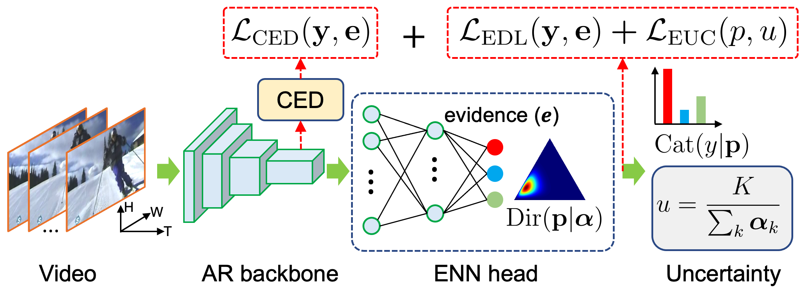

:boom:**Update**: 
- Thanks to the [issue#4](https://github.com/Cogito2012/DEAR/issues/4), the implementation of HSIC is incorrect due to the misunderstanding of `torch.diag`. Note that the issue even exists in our referred work [ReBias (ICML'21)](https://github.com/clovaai/rebias/blob/79d1d1d892412a5e3b07fbea8b776461bed0e096/criterions/hsic.py#L86). We have corrected this issue here [mmaction/models/heads/debias_head.py#L137](https://github.com/Cogito2012/DEAR/blob/12f8edd0d90d5aca9f443daea1c6b527dee5fb5b/mmaction/models/heads/debias_head.py#L137) but do not guarantee good performance.
- For a reasonable AUC evaluation, threshold is not necessary in practice. We recommend use the updated evaluation code script here: [`experiments/compare_openness_new.py`](experiments/compare_openness_new.py), but do not guarantee a good performance. 


# DEAR (Deep Evidential Action Recognition)
[Project](https://www.rit.edu/actionlab/dear) **|** [Paper & Supp](https://arxiv.org/abs/2107.10161)

[Wentao Bao](https://cogito2012.github.io/homepage), 
[Qi Yu](https://www.rit.edu/mining/qi-yu), 
[Yu Kong](https://www.egr.msu.edu/~yukong/)

International Conference on Computer Vision (**ICCV Oral**), 2021.

## Table of Contents
1. [Introduction](#introduction)
1. [Installation](#installation)
1. [Datasets](#datasets)
1. [Testing](#testing)
1. [Training](#training)
1. [Model Zoo](#model-zoo)
1. [Citation](#citation)

## Introduction
We propose the **D**eep **E**vidential **A**ction **R**ecognition (**DEAR**) method to recognize actions in an open world. Specifically, we formulate the action recognition problem from the evidential deep learning (EDL) perspective and propose a novel model calibration method to regularize the EDL training. Besides, to mitigate the static bias of video representation, we propose a plug-and-play module to debias the learned representation through contrastive learning. Our DEAR model trained on UCF-101 dataset achieves significant and consistent performance gains based on multiple action recognition models, i.e., **I3D**, **TSM**, **SlowFast**, **TPN**, with HMDB-51 or MiT-v2 dataset as the unknown.

<!-- <div align="center">
  <br>
    Overview of the DEAR
</div> -->
### Demo
The following figures show the inference results by the SlowFast + DEAR model trained on UCF-101 dataset.

<table>
  <tr>
    <td><p width=20px>UCF-101 </br> (Known)</p></td>
    <td></td>
    <td></td>
    <td></td>
    <td></td>
    <!-- <td></td> -->
   </tr> 
   <tr>
      <td><p width=20px>HMDB-51 </br> (Unknown)</p></td>
      <td></td>
      <td></td>
      <td></td>
      <!-- <td></td> -->
      <td></td>
   </tr>
</table>

## Installation
This repo is developed from [MMAction2](https://github.com/open-mmlab/mmaction2) codebase. Since MMAction2 is updated in a fast pace, most of the requirements and installation steps are similar to the version [MMAction2 v0.9.0](https://github.com/open-mmlab/mmaction2/tree/v0.9.0).

### Requirements and Dependencies
Here we only list our used requirements and dependencies. It would be great if you can work around with the latest versions of the listed softwares and hardwares on the latest MMAction2 codebase.
 - Linux: Ubuntu 18.04 LTS
 - GPU: GeForce RTX 3090, A100-SXM4
 - CUDA: 11.0
 - GCC: 7.5
 - Python: 3.7.9
 - Anaconda: 4.9.2
 - PyTorch: 1.7.1+cu110
 - TorchVision: 0.8.2+cu110
 - OpenCV: 4.4.0
 - MMCV: 1.2.1
 - MMAction2: 0.9.0

### Installation Steps

The following steps are modified from MMAction2 (v0.9.0) installation document. If you encountered problems, you may refer to more details in the [official document](https://github.com/open-mmlab/mmaction2/blob/v0.9.0/docs/install.md), or raise an issue in this repo. 

a. Create a conda virtual environment of this repo, and activate it:

```shell
conda create -n mmaction python=3.7 -y
conda activate mmaction
```

b. Install PyTorch and TorchVision following the [official instructions](https://pytorch.org/), e.g.,

```shell
conda install pytorch=1.7.1 cudatoolkit=11.0 torchvision=0.8.2 -c pytorch
```

c. Install mmcv, we recommend you to install the pre-build mmcv as below.

```shell
pip install mmcv-full==1.2.1 -f https://download.openmmlab.com/mmcv/dist/cu110/torch1.7.1/index.html
```
**Important:** If you have already installed `mmcv` and try to install `mmcv-full`, you have to uninstall `mmcv` first by running `pip uninstall mmcv`. Otherwise, there will be `ModuleNotFoundError`.

d. Clone the source code of this repo:

```shell
git clone https://github.com/Cogito2012/DEAR.git mmaction2
cd mmaction2
```


e. Install build requirements and then install DEAR.

```shell
pip install -r requirements/build.txt
pip install -v -e .  # or "python setup.py develop"
```

If no error appears in your installation steps, then you are all set!

## Datasets

This repo uses standard video action datasets, i.e., UCF-101 for closed set training, and HMDB-51 and MiT-v2 test sets as two different unknowns. Please refer to the default [MMAction2 dataset setup steps](/tools/data/ucf101/README.md) to setup these three datasets correctly.

**Note**: You can just ignore the `Step 3. Extract RGB and Flow` in the referred setup steps since all codes related to our paper do not rely on extracted frames and optical flow. This will save you large amount of disk space!

## Testing

To test our pre-trained models (see the [Model Zoo](#model-zoo)), you need to download a model file and unzip it under `work_dir`. Let's take the `I3D`-based DEAR model as an example. First, download the [pre-trained I3D-based models](https://drive.google.com/drive/folders/1TguABfmy0PE6jx9fflePQySe3jXWnsc0?usp=sharing), where the full DEAR model is saved in the folder `finetune_ucf101_i3d_edlnokl_avuc_debias`. The following directory tree is for your reference to place the downloaded files.
```shell
work_dirs    
├── i3d
│    ├── finetune_ucf101_i3d_bnn
│    │   └── latest.pth
│    ├── finetune_ucf101_i3d_dnn
│    │   └── latest.pth
│    ├── finetune_ucf101_i3d_edlnokl
│    │   └── latest.pth
│    ├── finetune_ucf101_i3d_edlnokl_avuc_ced
│    │   └── latest.pth
│    ├── finetune_ucf101_i3d_edlnokl_avuc_debias
│    │   └── latest.pth
│    └── finetune_ucf101_i3d_rpl
│        └── latest.pth
├── slowfast
├── tpn_slowonly
└── tsm
```

a. Closed Set Evaluation.

Top-K accuracy and mean class accuracy will be reported.
```shell
cd experiments/i3d
bash evaluate_i3d_edlnokl_avuc_debias_ucf101.sh 0
```

b. Get Uncertainty Threshold. 

The threshold value of one model will be reported.
```shell
cd experiments/i3d
# run the thresholding with BATCH_SIZE=2 on GPU_ID=0
bash run_get_threshold.sh 0 edlnokl_avuc_debias 2
```

c. Out-of-Distribution Detection.

The uncertainty distribution figure of a specified model will be reported.
```shell
cd experiments/i3d
bash run_ood_detection.sh 0 HMDB edlnokl_avuc_debias
```

d. Open Set Evaluation and Comparison.

The open set evaluation metrics and openness curves will be reported.

**Note**: Make sure the threshold values of different models are from the reported results in step b.
```shell
cd experiments/i3d
bash run_openness.sh HMDB  # use HMDB-51 test set as the Unknown
bash run_openness.sh MiT  # use MiT-v2 test set as the Unknown
```

e. Draw Open Set Confusion Matrix

The confusion matrix with unknown dataset used will be reported.
```shell
cd experiments/i3d
bash run_draw_confmat.sh HMDB  # or MiT
```

## Training

Let's still take the I3D-based DEAR model as an example. 
```shell
cd experiments/i3d
bash finetune_i3d_edlnokl_avuc_debias_ucf101.sh 0
```

Since model training is time consuming, we strongly recommend you to run the above training script in a backend way if you are using SSH remote connection.
```shell
nohup bash finetune_i3d_edlnokl_avuc_debias_ucf101.sh 0 >train.log 2>&1 &
# monitoring the training status whenever you open a new terminal
tail -f train.log
```

Visualizing the training curves (losses, accuracies, etc.) on TensorBoard:
```shell
cd work_dirs/i3d/finetune_ucf101_i3d_edlnokl_avuc_debias/tf_logs
tensorboard --logdir=./ --port 6008
```
Then, you will see the generated url address `http://localhost:6008`. Open this address with your Internet Browser (such as Chrome), you will monitoring the status of training.

If you are using SSH connection to a remote server without monitor, tensorboard visualization can be done on your local machine by manually mapping the SSH port number:
```shell
ssh -L 16008:localhost:6008 {your_remote_name}@{your_remote_ip}
```
Then, you can monitor the tensorboard by the port number `16008` by typing `http://localhost:16008` in your browser.

## Model Zoo

The pre-trained weights (checkpoints) are available below.
| Model | Checkpoint | Train Config | Test Config | Open maF1 (%) | Open Set AUC (%) | Closed Set ACC (%) |
|:--|:--:|:--:|:--:|:--:|:--:|:--:|
|I3D + DEAR |[ckpt](https://drive.google.com/file/d/1oRNBH0aAhFpcJSBqWlT4x0ru7iHfdndW/view?usp=sharing)| [train](configs/recognition/i3d/finetune_ucf101_i3d_edlnokl_avuc_debias.py) | [test](configs/recognition/i3d/inference_i3d_enn.py) | 77.24 / 69.98 | 77.08 / 81.54 | 93.89 |
|TSM + DEAR | [ckpt](https://drive.google.com/file/d/1TM1c28jRyZpOrWqwaQPYXFBZJXHQp__9/view?usp=sharing)| [train](configs/recognition/tsm/finetune_ucf101_tsm_edlnokl_avuc_debias.py) | [test](configs/recognition/tsm/inference_tsm_enn.py) | 84.69 / 70.15 | 78.65 / 83.92 | 94.48 |
|TPN + DEAR | [ckpt](https://drive.google.com/file/d/1jorfFMMzWd5xDCfZsemoWD8Rg7DbH16u/view?usp=sharing)| [train](configs/recognition/tpn/tpn_slowonly_edlloss_nokl_avuc_debias_r50_8x8x1_150e_kinetics_rgb.py) | [test](configs/recognition/tpn/inference_tpn_slowonly_enn.py) | 81.79 / 71.18 | 79.23 / 81.80 | 96.30 |
|SlowFast + DEAR |[ckpt](https://drive.google.com/file/d/13LNRv0BYkVfzCA95RB5dCp53MmErRL5D/view?usp=sharing)| [train](configs/recognition/slowfast/finetune_ucf101_slowfast_edlnokl_avuc_debias.py) | [test](configs/recognition/slowfast/inference_slowfast_enn.py) | 85.48 / 77.28 | 82.94 / 86.99 | 96.48 |

For other checkpoints of the compared baseline models, please download them in the [Google Drive](https://drive.google.com/drive/folders/1M8SryYc3mx27G_uMuynr8CIYRlKU17WO?usp=sharing).


## Citation
If you find the code useful in your research, please cite:

    @inproceedings{BaoICCV2021DEAR,
      author = "Bao, Wentao and Yu, Qi and Kong, Yu",
      title = "Evidential Deep Learning for Open Set Action Recognition",
      booktitle = "International Conference on Computer Vision (ICCV)",
      year = "2021"
    }

## License

See [Apache-2.0 License](/LICENSE)

## Acknowledgement

In addition to the MMAction2 codebase, this repo contains modified codes from:
 - [pytorch-classification-uncertainty](https://github.com/dougbrion/pytorch-classification-uncertainty): for implementation of the [EDL (NeurIPS-2018)](https://arxiv.org/abs/1806.01768).
 - [ARPL](https://github.com/iCGY96/ARPL): for implementation of baseline method [RPL (ECCV-2020)](https://www.ecva.net/papers/eccv_2020/papers_ECCV/papers/123480511.pdf).
 - [OSDN](https://github.com/abhijitbendale/OSDN): for implementation of baseline method [OpenMax (CVPR-2016)](https://vast.uccs.edu/~abendale/papers/0348.pdf).
 - [bayes-by-backprop](https://github.com/nitarshan/bayes-by-backprop/blob/master/Weight%20Uncertainty%20in%20Neural%20Networks.ipynb): for implementation of the baseline method Bayesian Neural Networks (BNNs).
 - [rebias](https://github.com/clovaai/rebias): for implementation of HSIC regularizer used in [ReBias (ICML-2020)](https://arxiv.org/abs/1910.02806)

We sincerely thank the owners of all these great repos!
